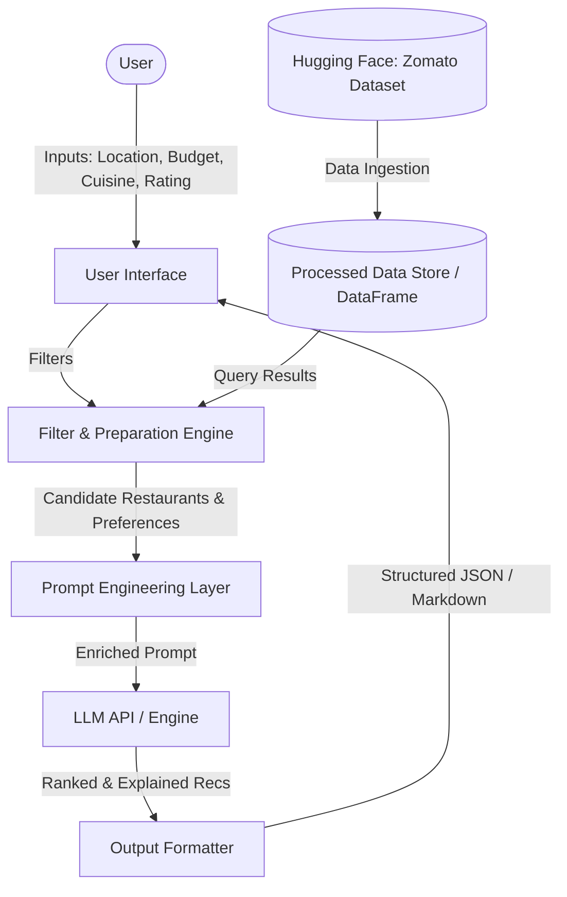

# System Architecture: AI-Powered Restaurant Recommendation System

This document outlines the detailed system architecture for the AI-Powered Restaurant Recommendation System based on the [context.md](file:///e:/doc/context.md) and [problemStatement.txt](file:///e:/doc/problemStatement.txt).

---

## 1. System Overview

The system is designed as a search, filter, and recommendation pipeline. It combines structured database query/filtering with unstructured language generation by a Large Language Model (LLM).



---

## 2. Detailed Component Breakdown

### A. Data Ingestion Module
* **Purpose**: Retrieves and normalizes the restaurant dataset.
* **Source**: Hugging Face dataset: `ManikaSaini/zomato-restaurant-recommendation`.
* **Process**:
  1. Load dataset using the Hugging Face `datasets` library or direct HTTP CSV download.
  2. Parse key-value columns (`name`, `location`, `cuisine`, `cost`, `rating`).
  3. Clean text data, handle missing ratings or costs, and cache the processed dataframe locally (e.g., in parquet or CSV format) to minimize network overhead.

### B. Filter & Query Processor
* **Purpose**: Performs deterministic rule-based filtering before sending candidates to the LLM. This prevents LLM hallucination and reduces token usage.
* **Rules**:
  * **Location Match**: Literal or substring match on city/neighborhood.
  * **Budget Filter**: Map "low", "medium", "high" categories to numerical cost ranges (e.g., Low: < $15, Medium: $15-$40, High: > $40).
  * **Cuisine Match**: Multi-select substring matching for tag matching (e.g., "Italian", "Chinese").
  * **Rating Filter**: Retain only restaurants where rating $\ge$ minimum user-specified rating.
* **Output**: A small set of filtered restaurant candidates (typically top 5–10).

### C. LLM Integration & Prompt Engine
* **Purpose**: Constructs a prompt that feeds candidate restaurant details along with user preferences to the LLM to get a human-like, comparative recommendation.
* **LLM Engine**: Groq API (utilizing models like `llama-3.3-70b-specdec` or `llama-3-70b-8192` for fast inference).
* **Prompt Schema**:
  ```yaml
  System Instructions: "You are a professional food critic and concierge chatbot. Suggest, explain, and rank restaurants based on user constraints."
  User Constraints: {location: X, budget: Y, cuisine: Z, rating: >=R, options: [other]}
  Candidate List:
    - Name: Rest1, Cuisine: Italian, Cost: Medium, Rating: 4.5
    - Name: Rest2, Cuisine: Italian, Cost: Low, Rating: 4.2
  ```
* **Output Requirements**: The LLM must output structured reasoning (JSON or clear Markdown) containing:
  * Rank order of candidates.
  * Contextual explanation (e.g., "Highly rated for quick service and fits your budget").
  * A concluding personalized summary.

### D. User Interface (UI) / Output Formatter
* **Purpose**: Accepts inputs and displays recommendations.
* **Layout**:
  * **Input Section**: Form with dropdowns/inputs for Location, Cuisine, Budget, Rating, and any free-text preferences.
  * **Results Panel**: Cards displaying:
    * **Restaurant Badge**: Name, rating, cost category.
    * **Cuisine & Location**: Meta-information.
    * **AI Explanation**: Highlighted reasoning text.

---

## 3. Data Flow Sequence

1. The user inputs their preferences via the Web UI.
2. The UI sends preferences to the backend.
3. The backend queries the preloaded dataset to find candidates matching the criteria.
4. Matches are formatted as a bulleted text summary.
5. The prompt builder joins the filtered list with the system guidelines and user-specific reasoning requests.
6. The prompt is sent to the LLM.
7. The LLM generates the recommendations and reasoning.
8. The backend parses the LLM output and renders it as cards on the UI.
